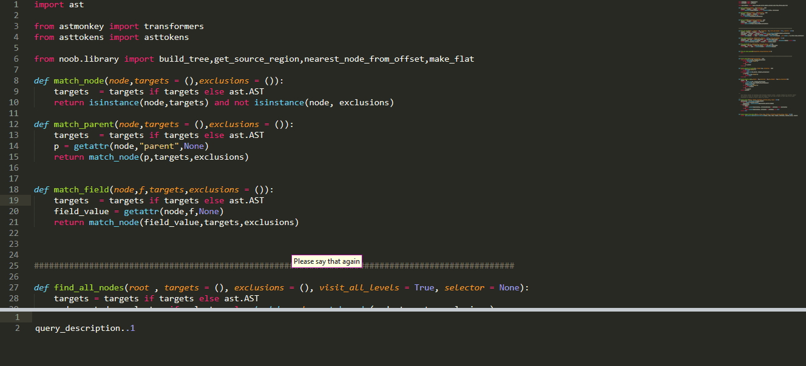
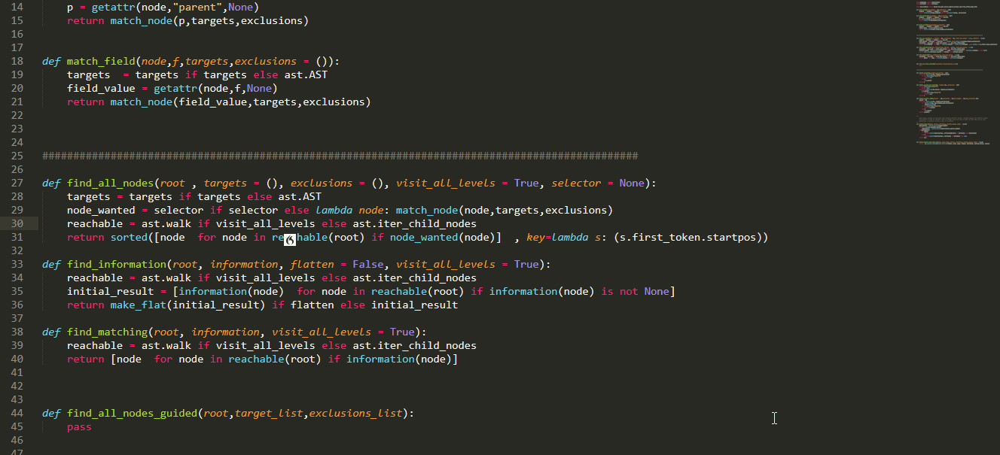

# PythonVoiceCodingPlugin

[](https://opensource.org/licenses/BSD-2-Clause)


PythonVoiceCodingPlugin is a Sublime Text 3 plugin meant to enhance user experience 
when coding python 3 by voice. 


## Motivation

The project was inspired by [Gustav Wengel's article](https://medium.com/bambuu/state-of-voice-coding-2017-3d2ff41c5015) on the state of voice coding  and my personal experiences
with  [Caster](https://github.com/dictation-toolbox/Caster). Despite the excellent work put behind this trully awesome [dragonfly](https://github.com/t4ngo/dragonfly) based toolkit, I felt there were cases we could do slightly better:)

In particular, navigation through the code sometimes felt a little bit too mechanistic. Say for instance you want to go to some location or select some text. For the most part ,you are  describing what actions 
need to be taken to get there. What if you could instead simply describe (syntactically)  what you want to select? 


PythonVoiceCodingPlugin tries to enable you to do just that!
To provide this functionality, it ships with bundles the implement a grammar, hopefully expressive enough for describing regions of interest, while running on the voice coding macro system side. These bundles
cooperate with the core plugin, running on the editor side, arguably the more suitable of the two environments
for analyzing source code and decoding the meaning of queries within the given context. 




I want to be honest. This is not exactly the best code ever written. It is far from it:) And it is far from the full functionality i would want it to offer. Nonetheless, I still think that PythonVoiceCodingPlugin is a tool that :

* will give you a first taste of AST navigation of your code using abstractions such as :
"smart if condition" or "below argument one"

* is easy to use and learn. Commands for the most part maintain a relatively clear structural pattern and sound pretty natural. 

* takes a first , though  addmittedly small, step towards reducing your dependency on the quality of speech recognition and your struggle with unspeakable words. 

* is designed on the realization that flexibility is key. I really want a lot of functionality available to you without the need to master the tool. To that end:

    - the tool will go to great lengths to try and decode what you meant from incomplete or insufficient or ambiguous descriptions and suggest meaningful , color highlighted alternatives:) 

   - even if you fail to get what you wanted as the main result , certain operations such as paste back can work with those alternatives instead without command overhead:)
   
   - as a side effect there are often more than one ways to select the same region so you can use whichever you think first:)


  
* is partly customizable. If you find yourself using certain commands with some given parameters often and want a shorthand smaller command, you can always follow my commented banana example:)




As I said, far (really far) from perfect but nonetheless an out-of-the-box solution which I hope to be helpful ,especially for beginners to get up to speed , and a step towards the right direction. I hope you enjoy using it as much as I have enjoyed coding it:)

Needless to say, while coding PythonVoiceCodingPlugin , PythonVoiceCodingPlugin was used :)

## Release and Version 

The code is available on [github](https://github.com/mpourmpoulis/PythonVoiceCodingPlugin)
along with its initial release (0.0.0)!

Update:  


## Limitations

There are of course certain limitations which I would like to make clear from the start: 

* Currently I do not fully support python > 3.3 (Still, you can work on code that contains some new features such as async and await keywords, f-strings). That's because Sublime uses python 3.3.6 and I rely on the standard library´s ast module to parse the code. An alternative could have been astroid but it itself uses typed_ast, which contains C code, something which I wanted to avoid. The plugin will most likely eventually change to a client server architecture and simply use an up to date ast module from python 3.7 or the new 3.8. please note that this restriction only concerns the users of new syntactical features. There is no problem , for instance, if you use a new standard library function.


* Furthermore, to be usable in practice it needs to be able to handle incomplete code(code where stuff is missing and thus cannot be parsed). It does so by "repairing" various common cases. Unfortunately it cannot handle everything you throw at it and in such cases most commands cannot run. Nonetheless, it can manage code like the one below:


## Installation 

Currently you can download the plugin directly from github and place it in sublime package folder

To install dependencies,using your installation of python (this worked for me with 3.7.4) run from inside the folder:
```bash
python3 -m pip install --target third_party -r requirements.txt
```

Be sure to check instructions to install the [bundles as well](bundles/README.md)


## Documentation

Documentation is available [here](doc/README.md)

## Support for voice coding framework

### Short version:

For the time being the full system has been tested with Caster 0.5.11 on a Windows 10 machine. I plan better support for aenea in the near future and would love to (if possible) provide bundles for more systems on the long run:) The plugin code itself is intentionally pure python so it should probably run fine on other OS that sublime supports (tp be updated after linux test)

### Long version:

Ok this can get a little bit  complicated because there is a variety of operating systems, speech recognition backends, macro systems and toolkits built upon them which may or may not introduce complications. To give you an example lets see a few cases of how Caster with Dragon Naturally Speaking can be used: 

- everything native in Windows 

- in combination with aenea on linux host with windows guest where dragon is running and keystrokes are send to the host via rpc commands 

- linux guest receiving keystrokes from pure dragonfly windows host 

- oh and what about that linux guest receiving aenea rpc from windows host?:)


To understand why all this may become an issue, we need to take a look at how communication between dragonfly and the plugin works. 


Probably by far the most convenient way is via sublime comand line interface. This is the default method used. For example after a command of the form 

```python
"[smart] [<adjective>] argument <argument_index>"
```
like

```
"first argument 2"
```

The script invokes the subl cli tool with a command like that:

``` bash
subl --command python_voice_coding_plugin { "arg" : {
  "command":"argument",
  "format":1,
  "adjective":"first",
  "argument_index":2,
  }
}
```
So effectively we trigger the command our plugin provides in its top file and pass information about the type of query we want and the parameters we used as a dict encoded as a json string. 

Of course this does not work across virtual machine barriers:) 

To counter this issue the simplest idea, which involves only keystrokes, is to open with some key command sublime console and using a text command to invoke the PythonVoiceCodingPlugin command from the command line. But 
from my experience this is often way to slow if there are a lot of parameters to pass and messes up with user-interface, as it opens up the console.

So this is not implemented, even though  it does not need custom rpc.


For the time being I have bundles for 0.5.11 release of Caster that work as expected on Windows 10 64bit.


## License

All code (grammar bundles and plugin) is licensed under 2-clause BSD License.

```
BSD 2-Clause License

Copyright (c) 2019, Kitsios Panagiotis
All rights reserved.

Redistribution and use in source and binary forms, with or without
modification, are permitted provided that the following conditions are met:

1. Redistributions of source code must retain the above copyright notice, this
   list of conditions and the following disclaimer.

2. Redistributions in binary form must reproduce the above copyright notice,
   this list of conditions and the following disclaimer in the documentation
   and/or other materials provided with the distribution.

THIS SOFTWARE IS PROVIDED BY THE COPYRIGHT HOLDERS AND CONTRIBUTORS "AS IS"
AND ANY EXPRESS OR IMPLIED WARRANTIES, INCLUDING, BUT NOT LIMITED TO, THE
IMPLIED WARRANTIES OF MERCHANTABILITY AND FITNESS FOR A PARTICULAR PURPOSE ARE
DISCLAIMED. IN NO EVENT SHALL THE COPYRIGHT HOLDER OR CONTRIBUTORS BE LIABLE
FOR ANY DIRECT, INDIRECT, INCIDENTAL, SPECIAL, EXEMPLARY, OR CONSEQUENTIAL
DAMAGES (INCLUDING, BUT NOT LIMITED TO, PROCUREMENT OF SUBSTITUTE GOODS OR
SERVICES; LOSS OF USE, DATA, OR PROFITS; OR BUSINESS INTERRUPTION) HOWEVER
CAUSED AND ON ANY THEORY OF LIABILITY, WHETHER IN CONTRACT, STRICT LIABILITY,
OR TORT (INCLUDING NEGLIGENCE OR OTHERWISE) ARISING IN ANY WAY OUT OF THE USE
OF THIS SOFTWARE, EVEN IF ADVISED OF THE POSSIBILITY OF SUCH DAMAGE.
```

## Dependencies

Many thanks to the contributors and maintainers of the following pypi packages:

* [asttokens](https://github.com/gristlabs/asttokens)

* [astmonkey](https://github.com/mutpy/astmonkey)

* [segment_tree](https://github.com/evgeth/segment_tree)

For specific versions be sure to check the requirements.txt

## Acknowledgements

### Useful Learning Resources

The following resources proved very helpfull for the success of the project. Many thanks to all the authors!

* [Green Tree Snakes](https://greentreesnakes.readthedocs.io/en/latest/nodes.html) an truly invaluable for this project tutorial of the python ast

* this [tutorial for python tokens](https://www.asmeurer.com/brown-water-python/tokens.html)

* sublime 3 [api documentation]( https://www.sublimetext.com/docs/3/api_reference.html#sublime.View )

* sublime 3 [unofficial documentation]( http://docs.sublimetext.info/en/latest/index.html  )

* the python 3.7 [grammar](https://docs.python.org/3.7/reference/grammar.html) specification

* of course [the sublime forum](https://forum.sublimetext.com/)


### Development tools


Many thanks to all of the developers that have put their time and effort behind projects such as

* Natlink

* Dragonfly

* Caster


