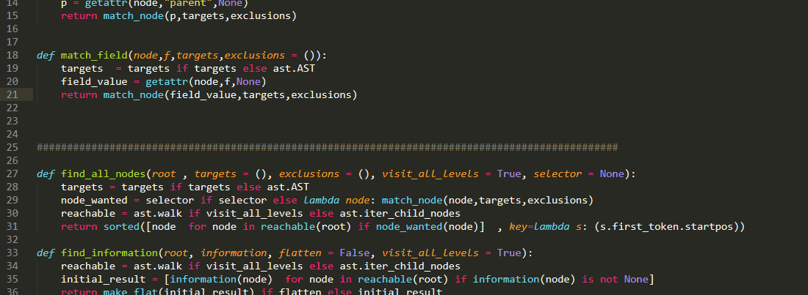
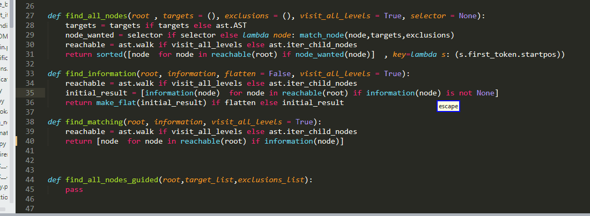
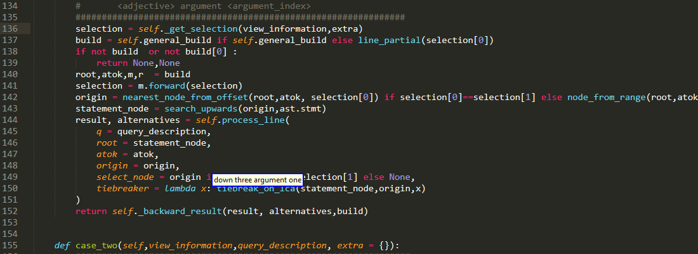

# Argument Selection Command


This is a SelectionQuery that enables you to select an argument from a function call.
It supports the following syntaxes: 

```python
"[smart] [<adjective>] argument <argument_index>"

"[smart] <vertical_direction> [<ndir>] [<adjective>] argument <argument_index>"

"[smart] [<adjective>] <level> [<level_index>] argument <argument_index>"

"[smart] <level> [<level_index>] <adjective> argument <argument_index>"
```

We will go briefly over each of these four posibilities, clarifying all the parameters and give you an idea of how they work. 

What you should keep in mind is that they search for results in a single line. For cases 1,3,4 that is the current line whereas for case 2 that is the line directly or indirectly specified.

## Case one 
The most simple command is 

```python
"[smart] argument <argument_index>"
```
argument_index is an integer

```python 
IntegerRefST("argument_index", 1, 10),
```
specifying which argument you want to select.



There are of course a couple of things to note:

* your selection does not have to be inside a function call to get a result. Remember the whole line is searched!

* as with most queries alternatives will (if any found) be offered!

* take a bit of care when you6 have selected whole regions of text insted of a single point

* regions nearer your selection in the AST will get prioritized!

To illustrate all of the above :





But what if you want to have more control over what you select?  In that case you might need to use an adjective as a positional descriptor as well. 

The adjective parameter is (as the name suggests) one or two adjectives such as first, second , last

```python
Choice("adjective",{ 

"first" : "first", "second": "second", "third": "third",

"fourth": "fourth", "fifth": "fifth", "sixth": "sixth",
 
"seventh": "seventh", "eighth": "eighth", "ninth":"ninth", 
  
"last":"last", "second last": "second last",

"third last": "third last", "fourth last": "fourth last", 


} )
```

specifying from which function call we want to select an argument:


Of course that was a trivial example and code can be much, much more complicated with lots of nested functions calls, brackets etc. The combinations of code structure, selection location and desired targets are literally dozens...

Just as an example, you might want the second call from the outermost level, the second relative to the selection from the current nested level, the second leftmost lexically appearing, the second within the list or tuple, or something matching any of the above criteria but inside your highlighted selection,etc... 

To deal with this issue without overloading you with too many rules to learn :), some designs decisions were made  >and the plugin tries to interpret your adjective description in a variety of ways:


The way this works is a little bit complicated but I hope you get the main idea.

## Case two 
 
What if you want to select something in a different line? Then you can use :
```python
"[smart] <vertical_direction> [<ndir>] [<adjective>] argument <argument_index>"
```  
Vertical direction is one of the below 4 keywords:
```python
Choice("vertical_direction",{ 

"up":"up", "down":"down",

"above":"above", "below":"below", 

} )
```
and ndir is an interger specifying how many lines (relative to the current) up or down your roi is.

But why both "above" and "up"? The difference lies in that above only counts "interesting lines", that is(physical) lines containing function calls. The following example should clarify this:



Though if we want to be more precise, we count lines that contain the beginning of function calls! this is important because logical lines can extend over multiple "physical" lines. The last example in the gif contains such an example, physical lines still determine the line to which above/below refer  and result and  alternatives from that physical line will be prioritized, but alternatives will also be offered from  the whole logical line! 


## Case three

now let's see something different:


in this example we use the command:

```python
"[smart] [<adjective>] <level> [<level_index>]  argument <argument_index>"
```
For the time being, the only available option for the level parameter is

```python
Choice("level",{
		"inside":"inside",
	}
),
```
by means of the keyword inside , we can specify that we want an argument from a function call that is nested inside another function call! The level_index parameter

Specifies the index of the argument of the outer function call our desired ROI lies in. In order to specify which outer function goal we are referring to we can optionally use an adjective :


## Case four

This, looks very similar to the previous one. However, instead of using the adjective specify the outer function call, we use it to specify which one from the nested ones we want:


As you can see, the syntax looks like:

```python
"[smart] <level> [<level_index>] <adjective> argument <argument_index>"
```


