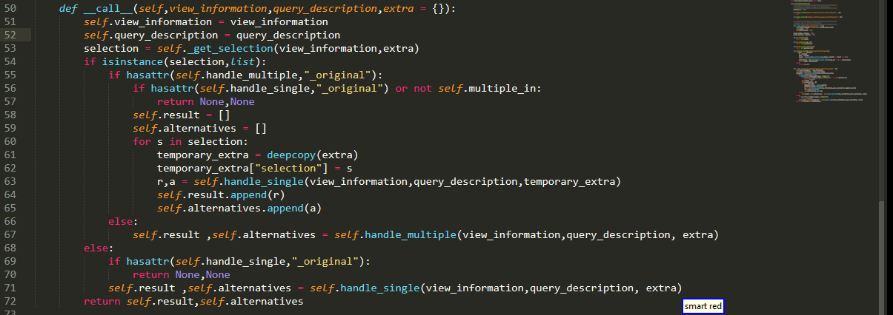

# Select Big Region of Interest Command

These commands are responsible for selecting "big" regions of interest. By "big" we refer to things like "if condition" or "assignment right" in contrast to say the first entry of a dictionary.

In particular, the currently offered "big roi´s" are :

```python
Choice("big_roi",{ 
"if condition" : "if condition", 
"else if condition" : "else if condition", 
"while condition" : "while condition", 

"if expression condition" : "if´´ expression condition", 
"if expression body" : "if expression body", 
"if expression":"if expression",

"return value" : "return value", 

"pass":"pass", 
"break" : "break", 
"continue" : "continue", 

"assertion message" : "assertion message",
 "assertion condition" : "assertion condition", 
 
"(assignment right| right)" : "assignment right",
"(assignment left| left)" : "assignment left", 
"assignment full" : "assignment full",

 "import statement":"import statement", 

"(expression statement|expression)" : "expression statement", 

"iterator" : "iterator", "iterable" : "iterable",
 } ),
```

I think most of them should be pretty self explanatory.

There are four syntaxes for this command:

```python 
"smart <big_roi> [<big_roi_sub_index>]"

"[smart] <adjective> <big_roi> [<big_roi_sub_index>]"

"[smart] <vertical_abstract_only_direction> [<ndir>] <big_roi> [<big_roi_sub_index>]"

"[smart] <vertical_abstract_only_direction> [<ndir>] <block> [<adjective>] <big_roi> [<big_roi_sub_index>]"
```

# Case one 

Ok lets start with the simple one, namely queries of the form: 

```python 
"smart <big_roi>"
``` 

As you might expect, the plugin will try to find matches to big roi description , prioritizing ones "nearer" in the AST with respect to the current selection.



However,there are cases where you are interested in only a portion of this whole ROI. For instance there may be multiple targets in the left hand of an assignment and you want to select only one of them. Or your function may return multiple values. In those cases the 

```python 
IntegerRefST("big_roi_sub_index",0,10),
```
comes in useful:


# Case two 

# Case three 

Another alternative you can use is to provide information about the relative vertical position of your ROI with a command like that:

```python
"[smart] <vertical_abstract_only_direction> [<ndir>] <big_roi> [<big_roi_sub_index>]"
```
The only difference compared to argument selection is that you can only use the more "abstract", 'above' and 'below' keywords:

```python 
Choice("vertical_abstract_only_direction",{ 
	"above":"above",
 	"below":"below", 
 } ),
```
As an example:


Another important detail is that these types of queries are not limited to searching only the current function like the adjective ones! 


# Case four 

Ok this is a bit different:)
This variant combines vertical and positional order information. 

```python
"[smart] <vertical_abstract_only_direction> [<ndir>] <block> [<adjective>] <big_roi> [<big_roi_sub_index>]"
```
What on earth is that "block" thing over there? Well for the time being there is only one option available:

```python 
Choice("block",{ 
		"(function|functions)" :"function",
	 } 
),
```

So essentially, we can specify a function using a relative vertical desciption with the above/below keywords!

```python 
<vertical_abstract_only_direction> [<ndir>] <block>
```


Once we have established which function we are to search, the command will then work more or less like cases one and two

```python
[<adjective>] <big_roi> [<big_roi_sub_index>]
```

 but will search inside that function!


