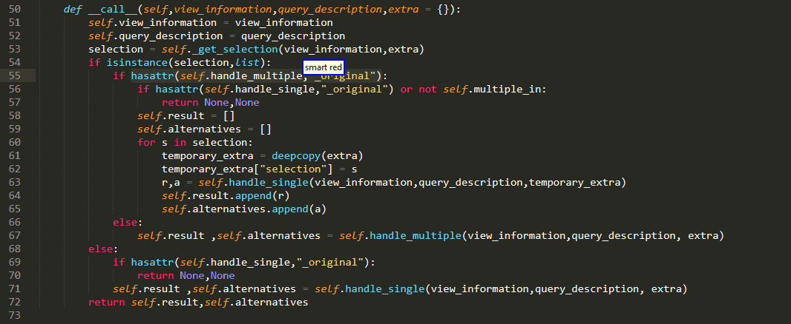
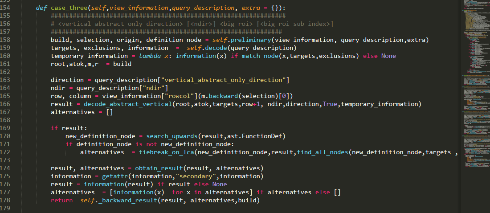

# Select Big Region of Interest Command

These commands are responsible for selecting "big" regions of interest. By "big" we refer to things like "if condition" or "assignment right" in contrast to say the first entry of a dictionary, though we will see later, by means of subindexes we can select [smaller stuff!](#SubIndexes)


In particular, the currently offered "big roi´s" are :

```python
Choice("big_roi",{ 
"if condition" : "if condition", 
"else if condition" : "else if condition", 
"while condition" : "while condition", 

"if expression condition" : "if expression condition", 
"if expression body" : "if expression body", 
"if expression":"if expression",

"return value" : "return value", 

"pass":"pass", 
"break" : "break", 
"continue" : "continue", 

"assertion message" : "assertion message",
 "assertion condition" : "assertion condition", 
 
"(assignment right| right)" : "assignment right",
"(assignment left| left)" : "assignment left", 
"assignment full" : "assignment full",

 "import statement":"import statement", 

"(expression statement|expression)" : "expression statement", 

"iterator" : "iterator", "iterable" : "iterable",
 } ),
```

I think most of them should be pretty self explanatory.

There are four syntaxes for this command:

```python 
"smart <big_roi> [<big_roi_sub_index>]"

"[smart] <adjective> <big_roi> [<big_roi_sub_index>]"

"[smart] <vertical_abstract_only_direction> [<ndir>] <big_roi> [<big_roi_sub_index>]"

"[smart] <vertical_abstract_only_direction> [<ndir>] <block> [<adjective>] <big_roi> [<big_roi_sub_index>]"
```

# Case one 

Ok lets start with the simple one, namely queries of the form: 

```python 
"smart <big_roi>"
``` 

As you might expect, the plugin will try to find matches to big roi description , prioritizing ones "nearer" in the AST with respect to the current selection.


t is also important to note that with exception of the import statements, all other queries search only within the current function.


# Case two 

another alternative are commands of the types:

```python 
"[smart] <adjective> <big_roi> [<big_roi_sub_index>]"
```
you should probably be already familiar with adjectives, so here is an example of how you can use them:


as with case one, only the current function searched. ( pay attention to my last example where alternatives are only offered from the nested function definition!)


# Case three 

Another alternative you can use is to provide information about the relative vertical position of your ROI with a command like that:

```python
"[smart] <vertical_abstract_only_direction> [<ndir>] <big_roi> [<big_roi_sub_index>]"
```
The only difference compared to argument selection is that you can only use the more "abstract", 'above' and 'below' keywords:

```python 
Choice("vertical_abstract_only_direction",{ 
	"above":"above",
 	"below":"below", 
 } ),
```
As an example:



Another important detail is that these types of queries are not limited to searching only the current function like the adjective ones! 


# Case four 

Ok this is a bit different:)
This variant combines vertical and positional order information. 

```python
"[smart] <vertical_abstract_only_direction> [<ndir>] <block> [<adjective>] <big_roi> [<big_roi_sub_index>]"
```
What on earth is that "block" thing over there? Well for the time being there is only one option available:

```python 
Choice("block",{ 
		"(function|functions)" :"function",
	 } 
),
```

So essentially, we can specify a function using a relative vertical desciption with the above/below keywords!

```python 
"<vertical_abstract_only_direction> [<ndir>] <block>"
```


Once we have established which function we are to search, the command will then work more or less like cases one and two

```python
"[<adjective>] <big_roi> [<big_roi_sub_index>]"
```

 but will search inside that function!


# SubIndexes

So far we have seen cases where we can select an entire region of interest.
However,there are cases where you are interested in only a portion of this whole ROI. For instance there may be multiple targets in the left hand of an assignment and you want to select only one of them. Or your function may return multiple values. or your right hand side contains a dictionary and you want a specific key-value pair. In those cases the 

```python 
IntegerRefST("big_roi_sub_index",0,10),
```
comes in useful:


Okay , can we do something similar for other cases? like select only a portion of an if condition?


As illustrated above, you need to pay attention to how the various conditions are bound together
(or binds weaker causing it to be higher in the AST) in the can only select smaller conditions  from the outermost level!

This feature existed ever since the initial release but was only documented on 0.0.1 . This release also expanded the feature from applying only to ast.BoolOp nodes to encompass ast.Compare nodes as well! in plain English:

  

furthermore, big_roi_sub_index can make our lives easier even in cases like the one below:

  

where we want to play with the indexes of a subscript!

Finally, we clarify one more thing! What about relative vertical offsets when using above? We know that these abstract vertical keywords only count interesting lines, but what do we count as interesting here? To stay compatible with all of the above, we count all lines containing our desired big region of interest regardless of whether we can extract or not from them information with the sub index! As an example:

  


please note however that there are limitations  and sub indexes are more of a solution to make the simplest case faster
rather than a systematic way of handling complex code!

